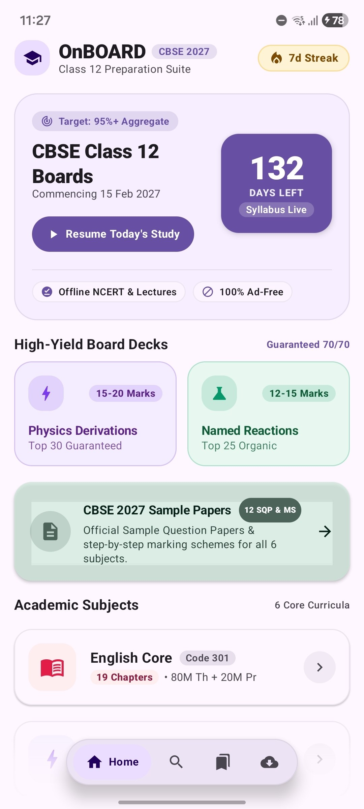
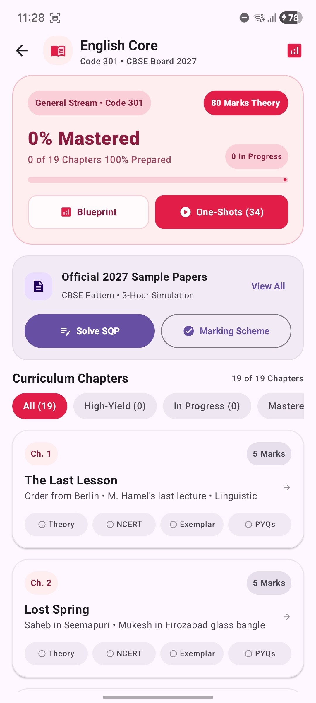
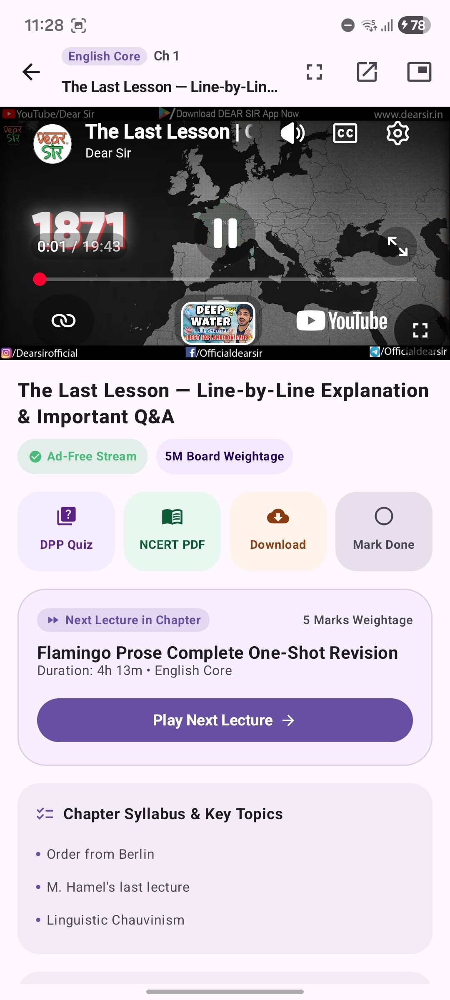
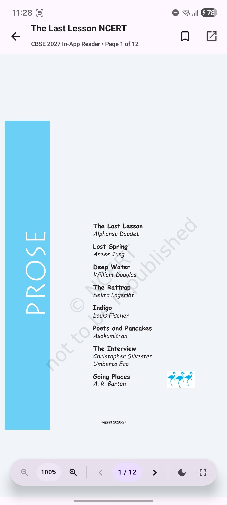
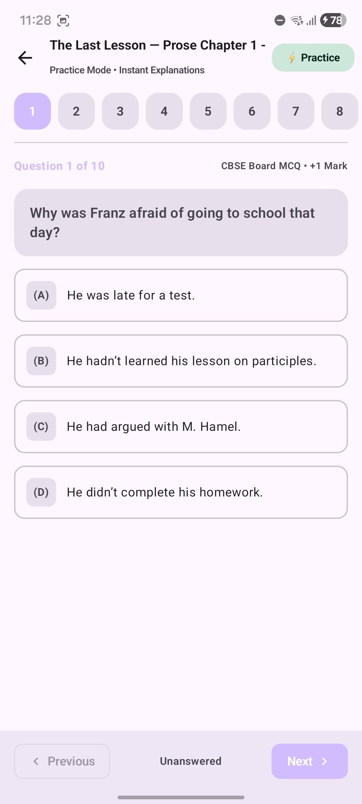
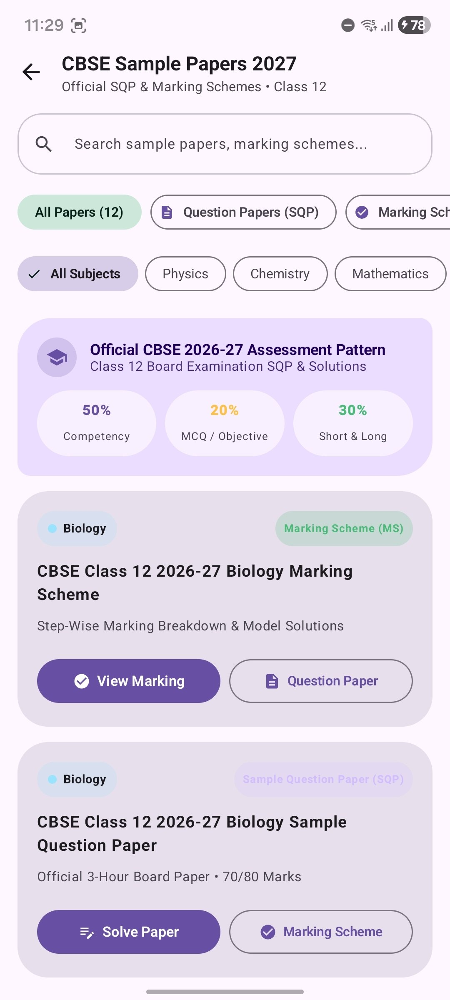

<div align="center">

  

# OnBOARD

**The Ultimate CBSE Class 12 Boards 2027 Preparation Suite for Android**  
*Pure, distraction-free board exam mastery. Zero ads, zero algorithmic rabbit holes.*

  <p>
    <a href="https://github.com/Marvelousshivam/OnBoard/stargazers">
      
    </a>
    <a href="https://github.com/Marvelousshivam/OnBoard/network/members">
      
    </a>
    <a href="https://github.com/Marvelousshivam/OnBoard/issues">
      
    </a>
    <a href="LICENSE">
      
    </a>
    <a href="#">
      
    </a>
    <a href="#">
      
    </a>
    <a href="#">
      
    </a>
  </p>

  <h3>
    <a href="#-about-onboard">About</a>
    <span> &bull; </span>
    <a href="#-screenshots">Screenshots</a>
    <span> &bull; </span>
    <a href="#-core-features">Features</a>
    <span> &bull; </span>
    <a href="#-tech-stack--architecture">Tech Stack</a>
    <span> &bull; </span>
    <a href="#-project-structure">Project Structure</a>
    <span> &bull; </span>
    <a href="#-installation--setup">Installation</a>
    <span> &bull; </span>
    <a href="#-roadmap">Roadmap</a>
    <span> &bull; </span>
    <a href="#-contributing">Contributing</a>
  </h3>

</div>

---

## <a id="-about-onboard"></a> About OnBOARD

> [!WARNING]
> **Active Work In Progress (Not Yet Completed):** OnBOARD is currently under active, continuous development for the upcoming CBSE 2026–2027 board examinations. Core architecture, curriculum manifest loading, ad-free video streaming, sample papers, and interactive quizzes are live, but several key areas—including major PDF viewer upgrades, exemplar question banks, and supplementary study resources—are still in progress.

> [!NOTE]
> **OnBOARD** is an offline-first, native Android study companion engineered specifically for students appearing in the **CBSE Class 12 Board Examinations (2026–2027)**. Designed around cognitive flow and deep focus, OnBOARD eliminates the distractions typical of commercial ed-tech apps—offering **100% ad-free video lectures**, native high-resolution **NCERT textbook reading with OLED dark mode**, interactive **Daily Practice Problem (DPP) quizzes**, and official **CBSE 2027 Sample Question Papers with step-wise Marking Schemes**.

> [!TIP]
> **Dynamic GitHub Manifest Sync:** The entire curriculum structure, lecture playlists, chapter notes, and quiz banks are decoupled from the APK. The app periodically and silently queries a remote GitHub manifest (`manifest.json`), ensuring that new lecture videos, chapter DPPs, and sample papers are pushed instantly to students without requiring app updates.

---

## <a id="-screenshots"></a> Visual Showcase

<div align="center">
  <table style="margin: 0 auto; border-collapse: collapse; border: none;">
    <tr>
      <td align="center" style="padding: 12px; border: none;">
        <b>Home Dashboard & Countdown</b><br><br>
        
      </td>
      <td align="center" style="padding: 12px; border: none;">
        <b>Subject Hub & Syllabus</b><br><br>
        
      </td>
      <td align="center" style="padding: 12px; border: none;">
        <b>Ad-Free Lecture Player</b><br><br>
        
      </td>
    </tr>
    <tr>
      <td align="center" style="padding: 12px; border: none;">
        <b>In-App Vector PDF Reader</b><br><br>
        
      </td>
      <td align="center" style="padding: 12px; border: none;">
        <b>Interactive DPP Quiz Engine</b><br><br>
        
      </td>
      <td align="center" style="padding: 12px; border: none;">
        <b>Official 2027 CBSE SQP & MS</b><br><br>
        
      </td>
    </tr>
  </table>
</div>

---

## <a id="-core-features"></a> Core Features

###  100% Offline NCERT Library & Curated Notes
> Instant access to every single chapter across all 6 core subjects.

*  **Full Class 12 Syllabus:** Comprehensive coverage of Physics (042), Chemistry (043), Mathematics (041), Biology (044), English Core (301), and Physical Education (048).
*  **Smart Caching:** Downloads PDFs on-demand and caches them permanently to device storage for zero-latency offline revision.
*  **High-Yield Board Decks:** Built-in cheat sheets and revision decks including **Top 30 Guaranteed Physics Derivations** (15–20 Marks) and **Top 25 Organic Named Reactions** (12–15 Marks).

---

###  In-App Vector PDF Reader
> Clean, hardware-accelerated reader designed for sustained academic reading without third-party PDF bloat.

*  **Native Hardware Acceleration:** Powered by Android's native `PdfRenderer` on a custom Jetpack Compose Canvas, rendering crisp vector diagrams and mathematical formulas at any zoom scale.
*  **OLED Night Inversion:** One-tap color matrix inversion for eye-friendly, true-black reading during late-night study marathons.
*  **Precision Navigation:** Interactive page jumper slider, zoom preset toggles (50% to 300%), fullscreen immersive mode, and external PDF viewer intent fallback.

---

###  Ad-Free Curated Video Lectures
> Focused video learning without recommendation feeds, comments, or banner advertisements.

*  **Dual-Engine Playback:** Seamlessly plays curated YouTube lecture playlists via an embedded IFrame bridge alongside direct `.mp4` and `.mkv` streams powered by **AndroidX Media3 ExoPlayer**.
*  **Local Storage Scanner:** Automatically scans and indexes downloaded board lecture files on local storage/SD card matching chapter nomenclature (`physics_ch01.mp4`, etc.), binding them directly to the chapter syllabus tree.
*  **Integrated Study Hub:** Every lecture player screen embeds direct shortcuts to the corresponding chapter's NCERT PDF, DPP Quiz, board weightage badge, and the next lecture in sequence.

---

###  Interactive DPP & Chapter Quiz Engine
> Practice under CBSE examination conditions with instant feedback and analytics.

*  **CBSE Board Pattern MCQs:** Timed, multiple-choice quizzes with official CBSE marking (+1 Mark, no negative marking for boards) and step-by-step rationales.
*  **Persistent Mastery Tracking:** Integrated Room DB logs test attempts, accuracy percentages, and completion status across all chapters to compute live subject mastery percentages.

---

###  Official CBSE 2027 Sample Papers & Marking Schemes
> Real exam simulation strictly matching the latest CBSE circulars and blueprints.

*  **Complete 6-Subject Collection:** Official CBSE Sample Question Papers (SQP) and step-by-step official Marking Schemes (MS) for Physics, Chemistry, Mathematics, Biology, English Core, and Physical Education.
*  **Assessment Blueprint Overview:** Outlines the 2026–27 exam weightage: **50% Competency-focused questions**, **20% MCQ/Objective**, and **30% Short & Long answer questions**.
*  **1-Tap Solution Toggle:** Instantaneous transition between the question paper and its official marking scheme for immediate self-evaluation.

---

## <a id="-tech-stack--architecture"></a> Tech Stack & Architecture

OnBOARD is engineered adhering strictly to Modern Android Architecture guidelines, utilizing an offline-first MVVM design pattern with Kotlin Coroutines and StateFlow:

```
┌────────────────────────────────────────────────────────┐
│                   UI Layer (Jetpack Compose)           │
│  Dashboard • SubjectHub • ChapterDetail • PdfViewer    │
│  QuizScreen • SamplePapers • VideoPlayer • Handbook    │
└───────────────────────────┬────────────────────────────┘
                            │ (StateFlow / Events)
┌───────────────────────────▼────────────────────────────┐
│                    ViewModel Layer                     │
│  State computation, UI logic, Navigation orchestration │
└───────────────────────────┬────────────────────────────┘
                            │ (Coroutines / Flow)
┌───────────────────────────▼────────────────────────────┐
│                   Repository Layer                     │
│       BoardsRepository • CurriculumManifestManager     │
└─────────────┬────────────────────────────┬─────────────┘
              │                            │
┌─────────────▼──────────────┐ ┌───────────▼─────────────┐
│    Local Persistence       │ │      Remote Sources     │
│  Room DB (SQLite)          │ │  GitHub Manifest (Sync) │
│  External Cache (PDF/MP4)  │ │  Raw Content / jsDelivr │
│  LocalDocumentScanner      │ │  YouTube IFrame Bridge  │
└────────────────────────────┘ └─────────────────────────┘
```

| Layer | Technology | Details |
| :--- | :--- | :--- |
| **Language** | Kotlin 2.0+ | 100% Kotlin codebase with strict type safety |
| **UI Toolkit** | Jetpack Compose + M3 | Material 3 Expressive, custom tonal surfaces, dynamic spring physics |
| **Local Database** | Room 2.6.1 | SQLite abstraction with reactive Kotlin Flow DAOs for offline mastery |
| **Video Engine** | Media3 ExoPlayer 1.4.1 | HLS, DASH, Progressive MP4 streaming & background audio handling |
| **Document Engine** | Android `PdfRenderer` | Hardware-accelerated canvas bitmap rendering with Matrix zoom & inverted shaders |
| **Networking & IO** | OkHttp 4.12.0 + Gson | Content manifest fetch, timeout policies, connection pooling |
| **Image Loading** | Coil Compose 2.7.0 | Asynchronous vector & thumbnail loading with memory caching |
| **Async Concurrency** | Kotlin Coroutines & Flow | Non-blocking background sync, I/O offloading (`Dispatchers.IO`) |

---

## <a id="-project-structure"></a> Project Structure

```
BoardsPrep/
├── app/
│   ├── src/main/
│   │   ├── java/com/boardsprep/onboard/
│   │   │   ├── core/
│   │   │   │   ├── pdf/
│   │   │   │   │   ├── LocalDocumentScanner.kt   # Scans local storage for chapter PDFs & notes
│   │   │   │   │   └── PdfRendererHelper.kt      # Native hardware-accelerated PDF page rasterizer
│   │   │   │   ├── playback/
│   │   │   │   │   ├── LectureDownloader.kt      # Background file downloader for offline video/notes
│   │   │   │   │   ├── LocalLectureScanner.kt    # Indexes local .mp4/.mkv files on device
│   │   │   │   │   ├── MediaPlaybackService.kt   # Media3 background playback service
│   │   │   │   │   └── StreamExtractor.kt        # Direct stream URL extractor
│   │   │   │   ├── sync/
│   │   │   │   │   └── GitHubContentSync.kt      # Silent remote manifest synchronizer
│   │   │   │   └── theme/
│   │   │   │       ├── Color.kt                  # Material 3 Expressive palettes & tonal containers
│   │   │   │       ├── Shapes.kt                 # Asymmetric rounded corner tokens
│   │   │   │       ├── Theme.kt                  # Dynamic color & system bars integration
│   │   │   │       └── Type.kt                   # Typography scale optimized for academic reading
│   │   │   ├── data/
│   │   │   │   ├── local/
│   │   │   │   │   ├── dao/Daos.kt               # Subject, Chapter, Resource, Quiz, and Progress DAOs
│   │   │   │   │   ├── entities/Entities.kt      # Room DB entity declarations
│   │   │   │   │   └── OnboardDatabase.kt        # Room database instantiation with auto-migrations
│   │   │   │   ├── models/Models.kt              # Clean domain data transfer objects
│   │   │   │   └── repository/
│   │   │   │       ├── BoardsRepository.kt       # Single source of truth combining Room & remote
│   │   │   │       └── CurriculumManifestManager.kt # Dynamic manifest fetching & JSON quiz parser
│   │   │   ├── ui/
│   │   │   │   ├── navigation/NavRoutes.kt       # Type-safe Compose navigation routes & arguments
│   │   │   │   └── screens/
│   │   │   │       ├── DashboardScreen.kt        # Home screen, CBSE 2027 countdown & quick links
│   │   │   │       ├── SubjectHubScreen.kt       # Subject dashboard, chapter list & progress metrics
│   │   │   │       ├── ChapterDetailScreen.kt    # Lectures, notes, DPPs, and key syllabus concepts
│   │   │   │       ├── VideoPlayerScreen.kt      # Ad-free ExoPlayer & YouTube lecture player
│   │   │   │       ├── PdfViewerScreen.kt        # Vector PDF viewer with zoom, jump & dark mode
│   │   │   │       ├── QuizScreen.kt             # Chapter DPP quiz engine with live scoring
│   │   │   │       ├── SamplePapersScreen.kt     # Official 2027 CBSE SQP & Marking Schemes hub
│   │   │   │       ├── HandbookScreen.kt         # Quick-revision formula sheets & cheat decks
│   │   │   │       └── DownloadsScreen.kt        # Offline downloaded media & documents manager
│   │   │   ├── MainActivity.kt                   # Single activity entry point with edge-to-edge
│   │   │   └── OnboardApplication.kt             # Application class initializing Room & repositories
│   │   └── res/                                  # Icons, drawables, and XML resource files
│   └── build.gradle.kts                          # App-level dependencies & compiler configurations
├── docs/
│   ├── assets/logo.png                           # High-res application brand logo
│   └── screenshots/                              # HD device mockups & screen captures
├── build.gradle.kts                              # Root buildscript
└── settings.gradle.kts                           # Module settings & repository resolution
```

---

## <a id="-installation--setup"></a> Installation & Setup

### Prerequisites
* **Android Studio:** Ladybug (2024.2.1) or newer recommended
* **Java Development Kit (JDK):** Version 17
* **Android SDK:** Compile SDK 35, Minimum SDK 30 (Android 11.0+)
* **Gradle:** Version 8.7+

### Building from Source

1. **Clone the repository:**
   ```bash
   git clone https://github.com/Marvelousshivam/OnBoard.git
   cd OnBoard
   ```

2. **Open in Android Studio:**
   * Select `File -> Open` and navigate to the cloned folder.
   * Allow Gradle to sync all dependencies and build variants.

3. **Build the Debug APK:**
   ```bash
   ./gradlew assembleDebug
   ```

4. **Install directly onto a connected device via ADB:**
   ```bash
   ./gradlew installDebug
   ```

> [!NOTE]
> When launching the app for the first time, ensure an active internet connection so that OnBOARD can pull the initial `manifest.json` curriculum catalogue. Once fetched, the entire catalog is cached in Room DB for complete offline functionality.

---

## <a id="-roadmap"></a> Project Roadmap & Development Status

> [!IMPORTANT]
> **Project Status: Active Work In Progress (Not Yet Completed)**  
> OnBOARD is an actively evolving platform tailored for the **2026–2027 CBSE Class 12 Board Exams**. Core foundations (manifest sync, video playback, sample papers, basic quiz engine, and offline reading) are operational, but the suite is **not yet completed**. Major enhancements—particularly advanced PDF viewer capabilities, full exemplar solutions, and expanded question archives—are under active daily engineering.

---

###  Phase 1: Core Foundation & Sync Engine (Completed)
- [x] Full Class 12 CBSE 2027 curriculum manifest for 6 core subjects
- [x] Dynamic background manifest sync from GitHub (`manifest.json`) with zero APK overhead
- [x] Ad-free lecture player combining YouTube embedded streams & local `.mp4`/`.mkv` storage indexing
- [x] Interactive chapter Daily Practice Problem (DPP) quizzes with instant grading & Room DB score tracking
- [x] Official CBSE 2026–27 Sample Question Papers (SQP) & step-wise Marking Schemes (MS)
- [x] High-Yield Decks (Top 30 Physics Derivations & Top 25 Organic Named Reactions)
- [x] Material 3 Expressive UI design with floating dock navigation and spring physics

---

###  Phase 2: PDF Viewer Upgrades (In Progress)
- [x] Native `PdfRenderer` hardware-accelerated canvas rasterizer
- [x] Zoom controls (pinch-to-zoom + 50% to 300% presets) and page jumper slider
- [x] OLED true-black night-mode invert filter for strain-free reading
- [ ] **Continuous Vertical Scrolling & Tile Caching:** Smooth 120Hz continuous vertical feed with pre-rendered page tiles to eliminate scroll latency
- [ ] **In-Document Full-Text Search:** Real-time keyword query with yellow highlight markers and match jump navigation
- [ ] **Handwriting & Stylus Annotation Layer:** Smooth low-latency pen, highlighter, underline, and eraser for scribbling notes directly in margins
- [ ] **Text Selection & Quick Copy:** Native word and paragraph selection for rapid formula and definition copying
- [ ] **Persistent Page Bookmarks & Sync:** Cross-session reading progress that automatically restores exact page and scroll offsets
- [ ] **Two-Page Spread Mode:** Dual-page landscape reading layout optimized for tablets and foldable devices

---

###  Phase 3: Comprehensive Academic Resources (In Progress)
- [x] Full Class 12 NCERT Textbooks for Physics, Chemistry, Math, Biology, English Core, and Physical Education
- [x] Official CBSE 2026–27 SQP and step-wise Marking Schemes for all 6 subjects
- [ ] **NCERT Exemplar Problems & Detailed Solutions:** Complete chapter-by-chapter problem sets with step-by-step solutions for Physics, Chemistry, Math, and Biology
- [ ] **Chapterwise Previous 10 Years Question Papers (PYQs 2015–2025):** Segmented by 1-mark, 2-mark, 3-mark, and 5-mark board weightage with official marking rubrics
- [ ] **High-Density Mind Maps & 1-Page Formula Summary Sheets:** Visual concept diagrams for rapid 15-minute pre-exam revision
- [ ] **Practical Exam Lab Manuals & Viva Voce Vault:** Core laboratory experiments, apparatus diagrams, observation tables, and top 100 viva questions
- [ ] **Competency-Based Case Study Question Banks:** Targeted case study practice sets strictly aligning with CBSE's 50% competency directive
- [ ] **English Core Writing Section Format Vault:** Official templates and sample solutions for Notices, Invitations, Letters to the Editor, and Articles

---

###  Phase 4: Firebase Cloud Sync & Cross-Device Ecosystem (In Progress)
- [ ] **Cross-Device Study Sync (Cloud Firestore):** Seamlessly sync reading progress, bookmarks, chapter mastery %, DPP scores, and study streak across multiple devices (phone, tablet, Chromebook).
- [ ] **Firebase Authentication:** 1-Tap Google Sign-In with anonymous guest mode and instant account linking to ensure study logs survive device resets.
- [ ] **Smart Study Push Notifications (FCM):** Distraction-free daily study nudges, countdown milestones ("*100 Days left until Physics Boards*"), and instant curriculum update alerts.
- [ ] **Dynamic Feature Flags & Remote Config:** Live feature toggles, urgent CBSE syllabus errata notices, and A/B tested study tools without APK redeployments.
- [ ] **Firebase Crashlytics & App Quality Monitoring:** Real-time crash diagnostics, ANR tracking, and 120Hz frame rendering benchmarks across entry-level and flagship devices.
- [ ] **Deterministic Offline-to-Cloud Conflict Resolution:** Local Room DB acts as the primary master with automated background synchronization to Firestore once connectivity resumes.

---

###  Phase 5: Advanced Intelligence & Examination Simulation (Planned)
- [ ] **On-Device / Cloud AI Doubt Solver:** Camera snap of complex equations with instant step-by-step solving logic (Gemini Nano / LLM API)
- [ ] **Spaced Repetition Flashcards:** Adaptive Leitner algorithm for mastering organic reactions, named laws, and physics formulas
- [ ] **Full 3-Hour Exam Simulation Mode:** Real-time exam countdown timer, section-wise jumping, and self-evaluation scoring
- [ ] **Study Analytics & Progress Export:** Weekly velocity charts, weak-area diagnostic heatmaps, and printable revision schedules

---

## <a id="-contributing"></a> Contributing

Contributions are welcomed! If you would like to help improve OnBOARD, submit new chapter DPPs, or add lecture recommendations:

1. **Fork** the repository.
2. **Create a feature branch:**
   ```bash
   git checkout -b feature/curriculum-enhancement
   ```
3. **Commit your modifications:**
   ```bash
   git commit -m 'feat: Add chemistry chapter 5 DPP and lecture playlist'
   ```
4. **Push to the branch:**
   ```bash
   git push origin feature/curriculum-enhancement
   ```
5. **Open a Pull Request** with a detailed summary of changes.

---

##  License

This project is licensed under the **MIT License**. See the [LICENSE](LICENSE) file for more details.

<div align="center">
  <sub>Engineered with care for CBSE Class 12 Board Aspirants. Built with 100% Kotlin & Jetpack Compose.</sub>
</div>
